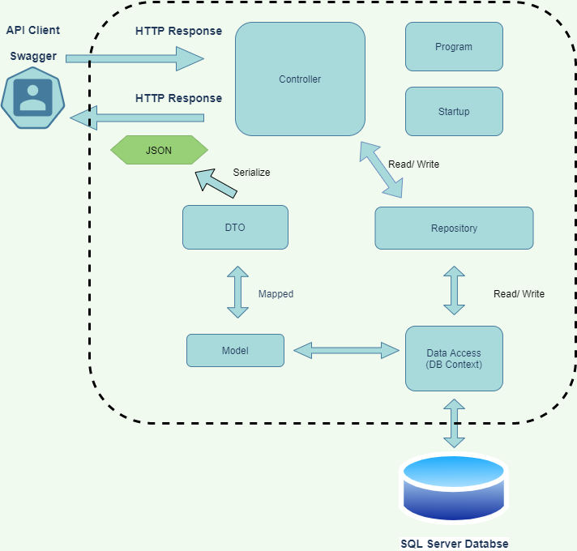

# ECOMMERCE WEB API

## Table of Contents
<!-- START doctoc generated TOC please keep comment here to allow auto update -->
<!-- DON'T EDIT THIS SECTION, INSTEAD RE-RUN doctoc TO UPDATE -->

- [System Overview - Describe the system and all its parts and how the application is architected.](#system-overview---describe-the-system-and-all-its-parts-and-how-the-application-is-architected)
- [Developer Setup](#developer-setup)
- [Troubleshooting - Common issues that you faced with setup or environments.](#troubleshooting---common-issues-that-you-faced-with-setup-or-environments)

<!-- END doctoc generated TOC please keep comment here to allow auto update -->

## System Overview - Describe the system and all its parts and how the application is architected.
The aim of the project is to develop an e-commerce type website API that allows CRUD operations against a list of products, users will be able:
- Get a specific product
- Get a list of products
- Add a new products
- Update a specific product
- Delete a specific product
- We will use Swagger UI which allows both developers and end consumers to visualize and interact with the API’s resources. Swagger is also used for the API documentation.

The ecommerce web api was designed as per following diagram:

As seen in the diagram below the application was developed using MVC pattern, therefore the solution has Controller, Models, Views.

The entry point of the application is Program.cs, which creates an instance of IWebHost which hosts the Ecommerce web application.

The Startup.cs is registered through Program.cs and it configures the way the application will respond to each HTTP request.

For defining the business logic of the ecommerce products, a Product model was created. This model will be used to save data and bind the view and the controller.

The controller, in our case ProductsController will be used for requests and actions handling.

For the view Swagger UI was used.

A database context was defined to serve as a mediator between the physical database and the rest of the application.

SQL Server was used for the physical database. 

In order to make the application loosely coupled as much as possible and to apply the best practices possible, a repository was created in order to serve as an abstraction layer between the data access layer and the business logic layer of the application. 

Repository pattern was implemented using Dependency Injection, i.e. the operations/ communications between Business Layer (Model and Controller), Data Layer with Repository Layer are implemented using Interface classes (IProductRepo.cs). Each layer has its own responsibilities and this is a clean example of Separation of Concerns(SoC). Parameterized constructor of controller was used to inject the dependency. .Net core built in support was used for dependency injection.
services.AddScoped<IProductRepo, ProductRepo>();

In order to standardize API responses structure and to decouple the service layer from the database layer, DTO (data transfer objects)  was used. DTO is a data contract. As seen from the Ecommerce web API diagram the actual DTO used is JSON format, i,e. responses and requests to the API are in JSON. 

Docker is used in order to deploy and run the application. The dockerfile is written as per Microsoft documentation https://docs.docker.com/samples/dotnetcore/. docker-compose.yaml defines the containers to be used for the SQL Server DB and the Ecommerce application. 
For the SQL server container the following were specified
- the image to used
- the ‘sa’ user database password
- the’1433’ port
For the application the following were specified
- build - to build the app from the current directory
- ports on which the app will run

The Ecommerce web API can be called at the following paths:
- GET localhost:8080/api/products - to list all the products
- GET localhost:8080/api/products/{id} - to get a specific product by its {id}, where {id} = number
- POST localhost:8080/api/products/ -  to add a new product to the database, a JSON with full details is passed
- PUT localhost:8080/api/products/{id} - to “fully update”a product identified by its id with a JSON containing all product fields
- PATCH localhost:8080/api/products/{id} - to “partially update” a specific product specified by its id
- DELETE localhost:8080/api/products/{id} - to delete a product identified by its id number
- localhost:8080/swagger/index.html - Swagger UI with the API documentation with the above mentioned available actions, were the API calls can be tested

The application can be called with and API request from Postman or any other similar application. localhost:8080/swagger/index.html can also be used.

## Developer Setup
The following packages were used for application development:
- Microsoft.EntityFrameworkCore
- Microsoft.EntityFrameworkCore.Design
- AutoMapper.Extensions.Microsoft.DependencyInjection - used for repository pattern with Dependency injection
- Microsoft.EntityFrameworkCore.SqlServer - in order for the application to use SQL Server Database
- Microsoft.AspNetCore.JsonPatch - used to implement DTO pattern
- Microsoft.AspNetCore.Mvc.NewtonsoftJson - used to implement DTO pattern
- Swashbuckle.AspNetCore - in order to use Swagger
- Docker - in order to dockerize the application and SQL server database

## Troubleshooting - Common issues that you faced with setup or environments.
I have faced the following issues:
- while configuring SQL Server through docker
- had issues with https certificates resolved through carefully following the documentation
- while using swagger, couldn’t use until installed child packages of Swashbuckle.AspNetCore
- didn’t create view with GUI I have used swagger instead
- while installing some packages, some latest versions of packages were incompatible with other packages so tried different versions to see which ones are compatible

Learning Materials used:
- Moodle B8IT147 Advanced Web Technologies learning materials
- .Microsoft .NET documentation
- Stackoverflow
- Youtube https://www.youtube.com/watch?v=fmvcAzHpsk8

